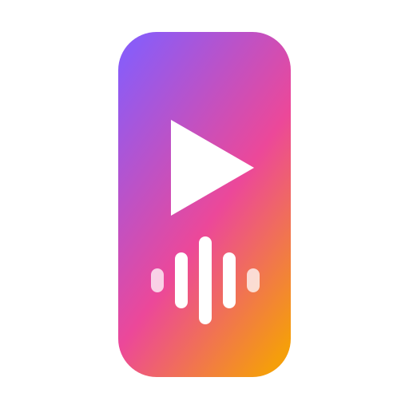
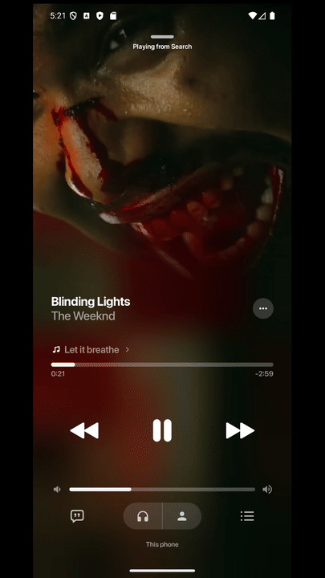
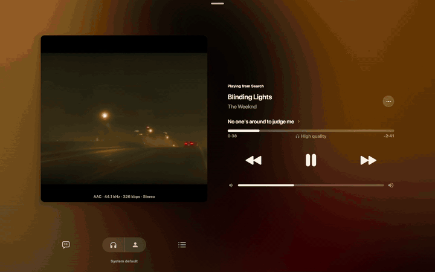
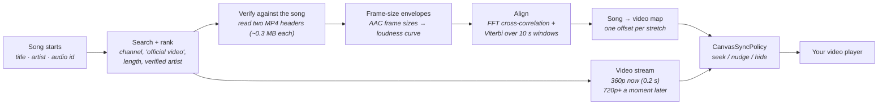

<p align="center"></p>

# OpenCanvas

> **The official music video of any song, playing full-screen behind your player and locked to the song — it jumps when the user seeks, starts with the next track, and never loops. Runs inside your app on Android and desktop JVM: no server, no helper process, no API key.**
> *Written by **Vijay Janarthanan**, Full Stack Developer • Apache 2.0*

[](https://kotlinlang.org/)
[](https://developer.android.com/)
[](https://www.jetbrains.com/lp/compose-multiplatform/)
[]()
[](LICENSE)
[](https://vijay-janarthanan.github.io/OpenCanvas/)

<p align="center"><a href="https://vijay-janarthanan.github.io/OpenCanvas/#try"></a></p>

---

<div align="center">
  <table>
    <tr>
      <td align="center" valign="top">
        <br />
        <b>Android</b> (emulator, 360p)<br />
        <sub>restart → video from 0:00 → seek to 1:40 → seek to 2:20<br /><a href="assets/opencanvas_android_showcase.mp4">▶ full 38 s video (MP4)</a></sub>
      </td>
      <td align="center" valign="top">
        <br />
        <b>Windows desktop</b> (BitChord)<br />
        <sub>the official video behind the player, lyrics on the right<br /><a href="assets/opencanvas_desktop_showcase.mp4">▶ full 20 s video (MP4)</a></sub>
      </td>
    </tr>
  </table>
  <p><sub>The recordings are real screen captures of the apps. A screen recorder cannot capture an app's audio, so the soundtrack is the music video's own audio, laid in at the position the picture shows; the measured drift between song and picture is in <a href="#-measured-not-claimed">Measured, not claimed</a>.</sub></p>
</div>

---

## 🌟 What it does

A streaming app knows the song it is playing. OpenCanvas finds that song's **official music video**, checks that it really is the same recording, works out how the song's timeline maps onto the video's, and then keeps the picture on the right second for as long as the song plays:

- **Starts at once.** The video's stream is known about half a second after the song starts (median 0.55 s on a cold cache) and the map is ready after about a second (median 0.95 s); a sharper 720p+ stream replaces the first one when it arrives.
- **Locked to the song, not looping.** A music video is rarely the album track with pictures: it has an intro, and often edits (a bar repeated, a bar cut). OpenCanvas measures a **map** — one offset per stretch of the song — so the picture stays right through the edits, and is hidden where the video has no matching scene.
- **Seeks and skips just work.** Seek in the song and the video jumps to the matching second; start the next track and its video begins immediately. Both are handled by a small, platform-independent policy ([`CanvasSyncPolicy`](packages/opencanvas-core/src/commonMain/kotlin/com/opencanvas/core/sync/CanvasSyncPolicy.kt)).
- **Lightweight.** Everything is learned from the *headers* of two small MP4 files — about 0.3 MB each — and a few milliseconds of arithmetic. Nothing is decoded, nothing is downloaded in full to find the sync, and the same code runs on every platform.
- **Self-contained.** One library, no daemon, no server of ours, no account or API key. It talks to YouTube's own servers the way YouTube's apps do, and nothing else.
- **Not tied to one app.** [BitChord](https://github.com/kushagrasinghx/BitChord) is the first host, not a requirement. Any player that knows the song's title, artist and where its audio can be read can use it (see [Use it in your app](#-use-it-in-your-app)).

---

## 📲 Try it

**In your browser, nothing to install: [Try it live](https://vijay-janarthanan.github.io/OpenCanvas/#try).** The engine is compiled to JavaScript and runs in the page: pick a real song and its official video plays behind it, held on the song's second as you seek; or let it measure a pair of MP4 files (a sample, or your own) from their headers.

Demo builds of BitChord with OpenCanvas are on the **[Releases page](https://github.com/Vijay-Janarthanan/OpenCanvas/releases)**:

<div align="center">

[-0078D6?style=for-the-badge&logo=windows)](https://github.com/Vijay-Janarthanan/OpenCanvas/releases/download/V1.1-demo/BitChord-OpenCanvas-windows-portable.zip)
[-3DDC84?style=for-the-badge&logo=android&logoColor=white)](https://github.com/Vijay-Janarthanan/OpenCanvas/releases/download/V1.1-demo/BitChord-OpenCanvas-android-arm64-debug.apk)

</div>

- **Windows 10/11 (x64):** unzip and run `BitChord.exe` (unsigned: SmartScreen may warn → "More info" → "Run anyway").
- **Android (arm64, most phones):** install the APK (allow "install unknown apps"). On an emulator use the [x86_64 build](https://github.com/Vijay-Janarthanan/OpenCanvas/releases/download/V1.1-demo/BitChord-OpenCanvas-emulator-x86_64-debug.apk).
- Checksums and notes: [Releases page](https://github.com/Vijay-Janarthanan/OpenCanvas/releases).

Play a song without label artwork, open the full player, then seek: the video follows. These are test builds, not official BitChord releases; checksums and notes are on the release page. BitChord is GPLv3 and the source of the builds is [the pull request branch](https://github.com/kushagrasinghx/BitChord/pull/646).

---

## 🧭 How it works



**Why frame sizes?** An AAC audio track is a sequence of frames, and the *size* of each frame follows the loudness and busyness of the music. The table of frame sizes sits in the file's header (`moov`), so reading about 300 KB of each of the two files gives a loudness-like curve for the song and for the video — no audio is downloaded or decoded. The two curves are aligned with FFT cross-correlation in 10-second windows, and a Viterbi pass picks one offset per window, charging for every change of offset (a chorus a minute away is a different place, not an edit). Consecutive windows with one offset become a segment. The candidate that lines up best wins, which is also what separates the official video from a lyric video, a live take or a re-upload; a "video" that is a still picture (under 40 kbit/s of video) is rejected by its bitrate.

**Why two tiers?** YouTube serves a 360p stream (itag 18) almost instantly, and a taller 720p/1080p stream through a second client a moment later. Both are asked for at once: the canvas starts on the first and is re-published with the sharper one (`SyncStage`: `PENDING` → `MEASURED`).

**Why ranged reads?** YouTube throttles an open-ended download of its adaptive streams to about 140 KiB/s (the 18 MiB 720p file takes ~132 s that way) but serves bounded ranges at line rate. [`ProgressiveRangeSource`](packages/opencanvas-core/src/jvmSharedMain/kotlin/com/opencanvas/core/stream/ProgressiveRangeSource.kt) starts with a small first range that grows, and answers a seek with a small range at the new position first, so playback never waits for a whole file.

---

## 📏 Measured, not claimed

Everything below was measured on one Windows 11 machine on a home connection, with the final code, from an empty cache and without the community maps. Raw reports are generated by the manual tests in [`packages/opencanvas-core/src/jvmTest/.../manual`](packages/opencanvas-core/src/jvmTest/kotlin/com/opencanvas/core/manual).

### Cold start, 16 songs in 6 languages — 16 of 16 aligned

| Stage | min | median | p90 | max |
| :--- | ---: | ---: | ---: | ---: |
| Music video found, first stream playable | 451 ms | **550 ms** | 643 ms | 688 ms |
| Song-to-video map ready | 596 ms | **954 ms** | 1 139 ms | 1 688 ms |
| Same song, map already cached | | **0–25 ms** | | |

English (8), Hindi (2), Tamil (2), Telugu (1), Korean (2), Spanish (1); songs from 2000 to 2022; full table with every title, offset and confidence in the [docs](https://vijay-janarthanan.github.io/OpenCanvas/#benchmarks). Offsets are what the map found: *Blinding Lights* starts 22.1 s into its video, *Dynamite* 22.8 s, *STAY* 19.4 s, *Kala Chashma* 17.0 s; for many songs the video carries the same master and the offset is 0.

### Getting the stream — the same 720p file (18 MiB, 263 s)

| Way of getting it | First byte | First second of video | Whole file |
| :--- | ---: | ---: | ---: |
| `yt-dlp -g` (spawn the tool, get the URL) | after 2.3–2.5 s | — | — |
| `yt-dlp` full download | — | — | 3.9–4.0 s |
| Plain HTTP GET of the file | 87 ms | 0.5 s | **132 s** (throttled to ≈ 140 KiB/s) |
| OpenCanvas `ProgressiveRangeSource` | **27 ms** | **27 ms** | 1.8 s |
| Seek to a random position (nothing buffered there) | **≈ 106 ms** to the first bytes of the new position | | |

The 360p muxed stream is not throttled: 10 MiB in 1.1 s, first bytes in 53 ms. Resolving a stream URL takes 60–400 ms (median 143 ms for 360p).

### How close the picture stays to the song

Measured on an Android emulator (4 GB RAM, software video decoding, 360p) by logging the app's own song clock and video clock, and by matching every captured frame against the source video:

| What | Result |
| :--- | :--- |
| Video position vs. the map's target, settled playback (50 samples, ≈ 40 s, with a restart and two seeks) | **96 % within ±150 ms**, median +49 ms, p95 147 ms, max 236 ms |
| Picture vs. song through the map (frame matching) | after settling: within ≈ 0.1–0.4 s, picture slightly ahead |
| First picture after a seek | ≈ 0.5 s after the tap, then smooth |
| Same measurement during a cold start while the emulator is busy loading | up to ≈ 1 s behind for the first ≈ 8 s, then within ±0.2 s |

These are emulator numbers: they are the evidence that the policy works and what an under-powered device does, **not** a measurement of a phone. We have not yet measured on physical devices.

### Honest comparison

We did not benchmark other libraries; this compares *approaches* and says what each costs.

| Approach | Covers any song | Locked to the song / survives seeks | Needs | Cost before the video can start |
| :--- | :---: | :---: | :--- | :--- |
| **Label-published loops** (Spotify Canvas, Apple motion artwork) | no — only what labels uploaded | no (a 3–8 s loop) | an account/token for some | a lookup |
| **Embed the YouTube player** | yes | no — it plays its own audio | its UI, ads and controls | the player's own load |
| **`yt-dlp` + play the file** | yes | no — you must work out the offset and handle seeks yourself | a Python tool on the device | 2.3–2.5 s to the URL, ≈ 4 s to download |
| **Decode both audio tracks and correlate them** | yes | yes | downloading and decoding two full audio streams | seconds of download and CPU (not measured here) |
| **OpenCanvas** | yes (16/16 in our matrix) | **yes** — segment map, seek-aware | nothing outside the library | **0.55 s** to a playable stream, **≈ 1 s** to the map, **0–25 ms** when cached |

---

## 🚀 Use it in your app

### 1. Dependency

```kotlin
repositories {
    mavenCentral()
    maven { url = uri("https://jitpack.io") }
}
dependencies {
    implementation("com.github.Vijay-Janarthanan:OpenCanvas:1.0.0")
    // optional Compose player
    implementation("com.github.Vijay-Janarthanan.OpenCanvas:opencanvas-compose:1.0.0")
}
```

### 2. Configure once, at app start

```kotlin
OpenCanvas.configure(
    OpenCanvasConfig(
        cacheDirectory = File(context.filesDir, "opencanvas"), // measured maps live here; null = memory only
        log = { Log.d("OpenCanvas", it) },                     // one line per stage, with timings
    ),
)
```

Every other setting has a working default (see [Configuration](#-configuration)).

### 3. Ask for the canvas when a track starts

```kotlin
// Optional but recommended: start the work the moment the song starts, before any screen asks.
OpenCanvas.prefetch(
    title = "Blinding Lights", artist = "The Weeknd", durationSec = 200,
    mode = OpenCanvasMode.FULL_SYNCED_VIDEO,
    resolution = OpenCanvasResolution.HD_720P,
    trackVideoId = "fHI8X4OXluQ",              // the YouTube (Music) id of the audio you are playing
)

// Later, from the screen that shows the video:
OpenCanvas.resolveFlow(
    title = "Blinding Lights", artist = "The Weeknd", durationSec = 200,
    mode = OpenCanvasMode.FULL_SYNCED_VIDEO,
    resolution = OpenCanvasResolution.HD_720P,
    trackVideoId = "fHI8X4OXluQ",
).collect { track ->
    when (track.syncStage) {
        SyncStage.PENDING  -> player.prepare(track.videoStreamUrl, track.videoHeaders) // buffer, don't show yet
        SyncStage.MEASURED -> { policy = CanvasSyncPolicy(track.syncMap(), track.videoDurationMs); showVideo() }
        SyncStage.NONE     -> showStillArtwork()   // no video lines up with this song
    }
}
```

The flow emits the track as soon as its stream is known (`PENDING`), again when the map is ready (`MEASURED`), and again if a taller stream turns up. Collectors of the same request share one measurement; abandon the flow and the work is dropped after a short grace. `resolve(...)` is the one-shot version that returns once the track is usable.

### 4. Keep the video on the song

```kotlin
// every 250 ms, and immediately after policy.seekDetected(...) or a track change
when (val action = policy.decide(songMs, videoPlayer.positionMs, songPlaying, videoPlayer.isReady)) {
    Hidden        -> showStillArtwork()          // this stretch of the song has no matching picture
    Hold          -> Unit
    Ended         -> showStillArtwork()          // the song outlasts the video: never loop
    is SeekTo     -> videoPlayer.seekTo(action.videoMs)
    is Nudge      -> videoPlayer.setSpeed(action.speed)   // ≤ ±5 %, imperceptible
}
```

The policy is pure Kotlin with no player in it: it works with ExoPlayer, VLC, Skiko, anything that can report a position and seek. On a track change, build a new policy from the new track.

### 5. Songs that are not on YouTube

Pass where the song's audio can be read once (an `http(s)` URL that honours range requests, or a file):

```kotlin
OpenCanvas.resolveFlow(title, artist, songAudio = SongAudio.Stream(File("/music/song.m4a")), mode = FULL_SYNCED_VIDEO)
```

### 6. Compose

`OpenCanvasPlayer` (module `opencanvas-compose`) takes the track and the song's position and hands your video surface the position that belongs to it through the map; it hides the picture where the map has none.

### Desktop JVM: optional yt-dlp

`YtDlpBackend` (desktop only, `jvmMain`) is an *optional* stream backend for machines that have `yt-dlp` installed; it warms itself up in the background. Nothing needs it — the default backends work on their own on every platform.

---

## ⚙️ Configuration

| `OpenCanvasConfig` | Default | What it is |
| :--- | :--- | :--- |
| `streamBackend` | `InnerTubeBackend.visionOs()` | resolves the sharp stream (720p+, plain URLs, no signature) |
| `instantBackend` | `InnerTubeBackend.android()` | resolves 360p at once and supplies the small MP4 the sync reads; `null` disables the two-step start |
| `cacheDirectory` | `~/.opencanvas/sync` (JVM), `null` (Android) | measured maps persist here; the next play of the song needs no measuring |
| `communityMapsUrl` | jsDelivr path of this repo | precomputed maps, one JSON per song; `null` disables |
| `httpClient` | tuned OkHttp | used for search, maps and audio ranges |
| `log` | silent | one line per stage |

Bring your own resolver by implementing [`StreamBackend`](packages/opencanvas-core/src/jvmSharedMain/kotlin/com/opencanvas/core/stream/StreamBackend.kt) (two small methods).

---

## 🧩 Platform & component status

| Component | Status | Where |
| :--- | :---: | :--- |
| On-device sync (frame-size envelope, FFT + Viterbi, segment map) | 🟢 | Android, desktop JVM (shared code) |
| Two-tier stream resolution (360p instant, 720p+ sharp) | 🟢 | Android, desktop JVM |
| Candidate search, ranking and audio verification | 🟢 | Android, desktop JVM |
| Ranged progressive playback source | 🟢 | desktop JVM (`ProgressiveRangeSource`); Android hosts use a chunked ExoPlayer data source |
| Position-locked playback policy (`CanvasSyncPolicy`) | 🟢 | common Kotlin |
| Map cache + prefetch + shared sessions | 🟢 | Android, desktop JVM |
| BitChord integration | 🟢 | Android APK, Windows desktop |
| Compose player (`opencanvas-compose`) | 🟡 follows the map; compile-checked on JVM, not yet run in a sample app | Compose Multiplatform |
| Looping canvas mode (YouTube "Most Replayed" window) | 🟡 unchanged from 1.0, not covered by the new benchmarks | JVM / Android |
| Subject-centred reframing (ONNX face tracker, 1-Euro filter) | 🟡 experimental, unchanged from 1.0, separate from the synced-video path | JVM |
| Community maps (`opencanvas-db`) | 🟡 wired in; no maps published yet | CDN |
| Browser engine (Kotlin/JS: `measure`, `WebCanvasPolicy`) | 🟢 measures a pair of MP4 files from their headers and keeps a `<video>` on the song; runs the [live demo](https://vijay-janarthanan.github.io/OpenCanvas/#try) (`tools/build-web-engine.sh`) | Browsers, Node |
| `@opencanvas/core` (TypeScript) and `open_canvas` (Dart) | 🟡 map and policy ported and tested against the same [vectors](packages/conformance/sync-vectors.json) as Kotlin, plus crop kinematics and a view; **no resolver or measuring** (use the Kotlin core or the browser engine) | React Native / Web / Flutter |
| iOS | 🔵 not started (the engine needs a Kotlin/Native port of the HTTP and storage parts) | |
| [`tools/opencanvas-stream-server`](tools/opencanvas-stream-server) | optional reference tool; **no app needs it** | Python |

---

## ⚠️ Limits you should know

- **It rides on YouTube's undocumented player endpoints** (the same ones its own apps use). They can change; the backends are pluggable for that reason, but today's defaults may need an update one day. Check YouTube's Terms of Service for your use case — OpenCanvas streams from YouTube's servers and stores nothing of YouTube's besides the numbers of the map.
- **A different mix, a live cut or a cover has no map**, so it gets no canvas (the still cover stays) rather than a wrong one. A heavily edited video is aligned piecewise and the unmatched stretches are hidden.
- **In BitChord a synced music video wins over a label's short loop** (Apple/Tidal/Spotify/community); the label sources are only the fallback for songs without a video that lines up.
- **We have measured on an emulator and a desktop, not on phones.** 720p decode cost and battery have not been measured.
- Maps are measured from the song's audio *as the player plays it*; if your player plays a different master than the YouTube Music id you pass, pass the right id (or `songAudio`).

---

## 🤝 Collaborate / ask a question

OpenCanvas is a one-person project and I would like to hear how you would use it.

- **Question or idea?** Open a [question or feature issue](https://github.com/Vijay-Janarthanan/OpenCanvas/issues/new/choose) — answers there help the next person.
- **Want to build on it, port it (iOS, web), or integrate it in your player?** Write to [vijaybfriendly@gmail.com](mailto:vijaybfriendly@gmail.com?subject=OpenCanvas%20collaboration) — I am happy to pair on an integration.
- **Found a song that does not work?** Open a bug with the title and artist; the log line from `OpenCanvasConfig.log` says why it was rejected.
- **Contributing code:** see [CONTRIBUTING.md](CONTRIBUTING.md).

### 💼 Hire me

I am **Vijay Janarthanan, a Full Stack Developer**, available for freelance work and full-time roles.

<div align="center">
  <a href="mailto:vijaybfriendly@gmail.com?subject=Project%20%2F%20Freelance%20Inquiry%20-%20OpenCanvas"></a>
  &nbsp;
  <a href="https://github.com/Vijay-Janarthanan"></a>
</div>

---

## 📄 License & attribution

Apache License 2.0. Forks, distributions and commercial implementations keep the attribution notice:

```
Powered by OpenCanvas (Created by Vijay Janarthanan <vijaybfriendly@gmail.com>)
```
