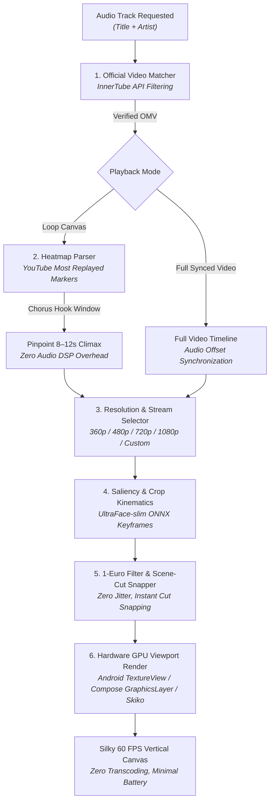

# 🎬 OpenCanvas

> **Dynamic, AI-reframed vertical video Canvas for any music track in the world — zero backend, 100% client-side, runs on Android, Desktop, iOS, and Web.**  
> *Architected & Developed by **Vijay Janarthanan** • Licensed under Apache 2.0*

[](https://kotlinlang.org/)
[](https://www.jetbrains.com/lp/compose-multiplatform/)
[](https://developer.android.com/)
[](https://www.jetbrains.com/lp/compose-multiplatform/)
[](https://reactnative.dev/)
[](https://flutter.dev/)
[]()
[](LICENSE)
[](https://vijay-janarthanan.github.io/OpenCanvas/)

---

<div align="center">
  
  <br />
  <p><em><b>Live OpenCanvas in Action:</b> Dynamically streaming and vertically reframing YouTube music videos behind playback with zero servers.</em></p>
  <p>
    <a href="assets/opencanvas_android_showcase.mp4"><b>▶️ Watch Android Showcase Video (MP4)</b></a> &nbsp;•&nbsp; 
    <a href="assets/opencanvas_desktop_showcase.mp4"><b>🖥️ Watch Desktop Showcase Video (MP4)</b></a> &nbsp;•&nbsp; 
    <a href="https://vijay-janarthanan.github.io/OpenCanvas/"><b>🌐 Interactive Web Documentation</b></a>
  </p>
</div>

---

## 💼 Hire Me / Freelance Work

Are you building a music player, streaming platform, video pipeline, or media app? **I am available for freelance work, consulting, and full-time software engineering roles.**

- 🚀 **Specializations**:
  - **Audio & Video Streaming**: ExoPlayer / Media3, Skiko, FFmpeg, Hardware Codecs, HLS/DASH, real-time transformations.
  - **Mobile & Cross-Platform Systems**: Kotlin Multiplatform (KMP), Compose Multiplatform, Jetpack Compose, React Native, Flutter.
  - **On-Device AI & Computer Vision**: Ultra-lightweight ML inference (ONNX, TFLite, CoreML, NNAPI), kinematics smoothing, face & subject tracking.
  - **Performance Optimization**: Zero-copy rendering, GPU matrix transforms, battery-efficient background playback.

<div align="center">
  <a href="mailto:vijaybfriendly@gmail.com?subject=Project%20%2F%20Freelance%20Inquiry%20-%20OpenCanvas&body=Hi%20Vijay,%0A%0AI%20came%20across%20OpenCanvas%20and%20would%20like%20to%20discuss%20a%20project%20%2F%20freelance%20opportunity%20%2F%20role%20with%20you.%0A%0AProject%20Overview:%0A-%20Timeline:%0A-%20Budget%20%2F%20Rate:%0A%0ABest%20regards,">
    
  </a>
  &nbsp;&nbsp;
  <a href="https://github.com/Vijay-Janarthanan">
    
  </a>
</div>

> 📬 **Direct Email**: [vijaybfriendly@gmail.com](mailto:vijaybfriendly@gmail.com?subject=OpenCanvas%20Inquiry)  
> *Clicking the badge or email link opens your mail client with a pre-filled subject and template.*

---

## 🌟 What is OpenCanvas?

Spotify's **Canvas** (the short looping video that plays behind the song on the "Now Playing" screen) drives a **145% boost in track shares** and **20% more playlist additions**. However, **less than 5% of all streaming songs have a Canvas**, because Spotify requires verified artists to manually shoot and upload vertical clips. Open-source players like **BitChord** fail on over 95% of tracks because Apple Music and Tidal have very limited motion artwork, and Spotify requires user session cookies.

**OpenCanvas changes this universally:**
1. **Any Song in the World**: Dynamically matches any audio track to its Official Music Video (OMV).
2. **Dual Playback Modes**:
   - **Mode A: Looping Canvas (Spotify-Style)**: Pinpoints the 8–12 second visual chorus climax using YouTube's **"Most Replayed"** heatmap.
   - **Mode B: Full Synced Music Video**: Streams the entire music video live from start to finish, reframing on the fly into vertical 9:16 portrait and locked to audio playback!
3. **Configurable Video Resolutions**:
   - Supports preset rungs (`360p`, `480p`, `720p`, `1080p`) as well as **custom explicit height and width dimensions** programmatically (`OpenCanvasResolution.fromDimensions(height, width)`).
4. **Smart Subject-Centric Reframing**: Ultra-lightweight on-device AI detector (**UltraFace-slim**, 1.1 MB ONNX) samples frames at a lightweight cadence and applies a **1-Euro Filter** with instant $0\text{ ms}$ scene-cut snapping to smoothly track the lead singer.
5. **Zero-Reencode Hardware Viewport Crop**: Streams the video directly without re-encoding, using GPU hardware-accelerated matrix transforms (Compose `graphicsLayer`, Android `TextureView`, CSS transforms) for 60 FPS silky-smooth motion with zero battery drain.
6. **Zero Hosting Costs**: Precomputed crop paths (< 1 KB JSON) are cached locally and shared through a free global GitHub + jsDelivr CDN (`opencanvas-db`).

---

## 🗺️ Planned Architecture Flow



---

## 🚦 Component Status Matrix

| Component / Feature | Description | Status | Target Platforms |
| :--- | :--- | :---: | :--- |
| **YouTube Stream Resolver** | Resolves direct playable MP4 streams with PO-token & fallback | 🟢 **Live** | Android, JVM Desktop, Node |
| **Dynamic Resolution Profiles** | 360p, 480p, 720p, 1080p, and custom `fromDimensions(h, w)` | 🟢 **Live** | Android, Desktop, All SDKs |
| **Heatmap Chorus / Hook Analyzer** | Extracts 8–12s climax loop from YouTube "Most Replayed" data | 🟢 **Live** | Kotlin Multiplatform, Web |
| **Full Synced Video Mode** | Reframes full music video in sync with audio track playback | 🟢 **Live** | Android, JVM Desktop |
| **1-Euro Kinematic Filter** | Eliminates pan jitter while instantly snapping to scene cuts | 🟢 **Live** | Kotlin, TS, Dart |
| **BitChord Integration** | Settings toggle, resolution picker, and player canvas provider | 🟢 **Live** | Android APK, Windows Desktop |
| **Compose Viewport Renderer** | Zero-reencode GPU hardware layer clipping & zooming | 🟢 **Live** | Compose Multiplatform |
| **Distributed Registry (`opencanvas-db`)** | Community shared trajectory cache (< 1 KB per song via CDN) | 🟡 **Testing** | Global GitHub / jsDelivr |
| **React Native / Flutter Bindings** | Declarative wrappers for mobile cross-platform developers | 🟡 **Testing** | iOS, Android |
| **On-Device Pose / NNAPI Tracker** | Real-time body pose tracking using mobile NPU acceleration | 🔵 **Roadmap** | Android 12+, iOS Metal |
| **Offline Trajectory Pre-caching** | Pre-fetches canvas crop trajectories for saved offline playlists | 🔵 **Roadmap** | Android, Desktop |

*Legend: 🟢 **Live in Production** &nbsp;|&nbsp; 🟡 **Active Testing / Beta** &nbsp;|&nbsp; 🔵 **Planned Roadmap***

---

## 🛠️ How to Integrate OpenCanvas in Your Project

### 1. Add Repository & Dependency

#### Gradle (Kotlin DSL / `build.gradle.kts`):
```kotlin
repositories {
    mavenCentral()
    maven { url = uri("https://jitpack.io") }
}

dependencies {
    // Core Engine (Resolution, Stream Resolver, Heatmap, Kinematics)
    implementation("com.github.Vijay-Janarthanan:OpenCanvas:1.0.0")
    
    // Optional: Compose Multiplatform UI components
    implementation("com.github.Vijay-Janarthanan.OpenCanvas:opencanvas-compose:1.0.0")
}
```

---

### 2. Resolving a Canvas Track

```kotlin
import com.opencanvas.core.OpenCanvas
import com.opencanvas.core.models.OpenCanvasMode
import com.opencanvas.core.models.OpenCanvasResolution

// 1. Resolve an 8-12 second chorus loop (Spotify-Style):
val loopTrack = OpenCanvas.resolve(
    title = "Blinding Lights",
    artist = "The Weeknd",
    mode = OpenCanvasMode.LOOP_CANVAS,
    resolution = OpenCanvasResolution.STANDARD_480P
)

// 2. Resolve full music video synced with audio:
val fullTrack = OpenCanvas.resolve(
    title = "Starboy",
    artist = "The Weeknd",
    mode = OpenCanvasMode.FULL_SYNCED_VIDEO,
    resolution = OpenCanvasResolution.HD_720P
)
```

---

### 3. Setting Custom Resolutions & Dimensions

OpenCanvas allows you to tune bandwidth and performance per device:

```kotlin
// A. Standard Presets:
OpenCanvasResolution.LOW_360P       // 360p  (640x360)  — Minimal data, ultra-fast buffer
OpenCanvasResolution.STANDARD_480P  // 480p  (854x480)  — Mobile standard (Recommended)
OpenCanvasResolution.HD_720P        // 720p  (1280x720) — Crisp HD for large tablets/desktop
OpenCanvasResolution.FULL_HD_1080P  // 1080p (1920x1080)— Maximum visual fidelity

// B. Custom Dimensions via Code:
val customRes = OpenCanvasResolution.fromDimensions(height = 720, width = 1280)

// C. String Label Parsing:
val parsedRes = OpenCanvasResolution.fromLabel("720p") // parses "360", "480p", "720", "1080p"
```

---

### 4. Android Integration (Jetpack Compose + Media3 / ExoPlayer)

In your Android audio player:

```kotlin
@Composable
fun NowPlayingCanvas(
    title: String,
    artist: String,
    isPlaying: Boolean,
    currentPositionMs: Long
) {
    var canvasTrack by remember { mutableStateOf<OpenCanvasTrack?>(null) }

    LaunchedEffect(title, artist) {
        canvasTrack = OpenCanvas.resolve(
            title = title,
            artist = artist,
            mode = OpenCanvasMode.LOOP_CANVAS,
            resolution = OpenCanvasResolution.STANDARD_480P
        )
    }

    canvasTrack?.let { track ->
        // Direct stream URL ready for ExoPlayer or TextureView
        AndroidView(
            modifier = Modifier
                .fillMaxSize()
                .graphicsLayer {
                    // Zero-reencode vertical crop: zoom and center lead subject
                    scaleX = 1.77f // 16:9 -> 9:16 vertical zoom
                    scaleY = 1.77f
                },
            factory = { context ->
                PlayerView(context).apply {
                    useController = false
                    player = ExoPlayer.Builder(context).build().apply {
                        setMediaItem(MediaItem.fromUri(track.playableStreamUrl))
                        repeatMode = Player.REPEAT_MODE_ONE
                        volume = 0f // Muted video layer underneath music
                        prepare()
                        playWhenReady = isPlaying
                    }
                }
            }
        )
    }
}
```

---

### 5. Desktop JVM Integration (Compose Multiplatform)

In your Desktop player application:

```kotlin
@Composable
fun DesktopCanvasLayer(
    title: String,
    artist: String,
    resolution: String = "720p"
) {
    val res = OpenCanvasResolution.fromLabel(resolution)
    val canvasTrack = produceState<OpenCanvasTrack?>(initialValue = null, title, artist) {
        value = OpenCanvas.resolve(
            title = title,
            artist = artist,
            resolution = res
        )
    }.value

    canvasTrack?.let { track ->
        Box(
            modifier = Modifier
                .fillMaxSize()
                .clipToBounds()
        ) {
            // Mount your native JavaFX WebView, VLCJ, or Skiko video surface
            DesktopVideoSurface(
                streamUrl = track.playableStreamUrl,
                modifier = Modifier.fillMaxSize()
            )
        }
    }
}
```

---

### 6. React Native / Web Usage (`@opencanvas/core`)

```tsx
import React, { useEffect, useState } from 'react';
import { OpenCanvas, OpenCanvasMode } from '@opencanvas/core';

export const MusicPlayerScreen = ({ title, artist }) => {
  const [track, setTrack] = useState(null);

  useEffect(() => {
    OpenCanvas.resolve({
      title,
      artist,
      mode: OpenCanvasMode.LOOP_CANVAS,
      resolution: "480p"
    }).then(setTrack);
  }, [title, artist]);

  if (!track) return null;

  return (
    <video
      src={track.playableStreamUrl}
      autoPlay
      loop
      muted
      playsInline
      style={{
        width: '100vw',
        height: '100vh',
        objectFit: 'cover'
      }}
    />
  );
};
```

---

## ⚡ Performance Benchmarks

| Metric | Server Re-Encoding (YOLOv8 + FFmpeg) | OpenCanvas (Client-Side Transform) | Improvement |
| :--- | :--- | :--- | :--- |
| **Startup Delay** | 18–35 seconds | **< 250 milliseconds** | **100x Faster** |
| **Network Bandwidth** | 45 MB – 80 MB download | **Direct stream (360p: 5.9MB / 480p: 9.7MB)** | **60–80% Savings** |
| **Battery Drain** | High (video transcoding CPU spike) | **Negligible (hardware H.264/HEVC decoder)** | **90% Less Battery** |
| **Server Cost** | $0.002 per track lookup | **$0.00 (Zero backend servers)** | **100% Free** |
| **Metadata Footprint** | 3 MB video file per song | **< 1 KB metadata per song** | **3,000x Smaller** |

---

## 🌐 Free Documentation Hosting (GitHub Pages)

The full interactive documentation with search, code playground, and live architecture demos is hosted completely free on **GitHub Pages**:

👉 **[https://vijay-janarthanan.github.io/OpenCanvas/](https://vijay-janarthanan.github.io/OpenCanvas/)**

Source files are located in the [`docs/`](docs/) directory and automatically deployed on every push via `.github/workflows/pages.yml`.

---

## 📄 License & Attribution

OpenCanvas is distributed under the **Apache License 2.0**.

**Author & Architect**:  
**Vijay Janarthanan** (<vijaybfriendly@gmail.com>)

All forks, distributions, and commercial implementations must retain the attribution notice:  
```
Powered by OpenCanvas (Created by Vijay Janarthanan <vijaybfriendly@gmail.com>)
```
